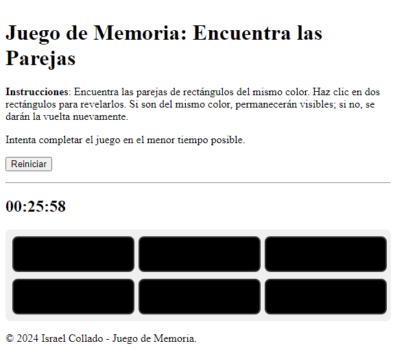

# Juego de Memoria: Encuentra las Parejas de Colores

## Descripción
Este es un juego de memoria interactivo donde los jugadores deben encontrar parejas de cuadrados del mismo color en una cuadrícula. El juego está desarrollado con JavaScript vanilla y utiliza Vite como herramienta de construcción.




## Características
- Cuadrícula de cuadrados con colores ocultos
- Temporizador para medir el tiempo de juego
- Almacenamiento local para guardar el progreso del juego
- Diseño responsive para diferentes dispositivos

## Tecnologías Utilizadas


## Instalación
1. Clona este repositorio:
   ```
   git clone https://github.com/israelinxy/memory-color-pairs.git
   ```
2. Navega al directorio del proyecto:
   ```
   cd memory-color-pairs
   ```
3. Instala las dependencias:
   ```
   npm install
   ```

## Uso
Para iniciar el servidor de desarrollo:
```
npm run dev
```

Para construir el proyecto para producción:
```
npm run build
```

Para previsualizar la versión de producción:
```
npm run preview
```

## Estructura del Proyecto
- `index.html`: Página principal del juego
- `sass/`: Archivos SCSS
- `src/`: Directorio de código fuente
  - `main.js`: Punto de entrada de la aplicación
  - `game.js`: Lógica principal del juego
  - `box.js`: Clase para los cuadrados individuales
  - `timer.js`: Clase para el temporizador
  - `utils/`: Utilidades y funciones auxiliares

## Cómo Jugar
1. Al iniciar el juego, se te pedirá que ingreses el número de filas y columnas para la cuadrícula.
2. Haz clic en los cuadrados para revelar sus colores.
3. Intenta encontrar todas las parejas de colores en el menor tiempo posible.
4. Si fallas al encontrar una pareja, los cuadrados se voltearán de nuevo.
5. El juego termina cuando todas las parejas han sido encontradas.

## Contribuciones 🤝

Las contribuciones son bienvenidas. Para problemas, ideas o nuevas características, por favor abre un issue o un pull request.

## Contacto 📫

¿Necesitas un diseño web personalizado? Contáctame:

[](mailto:israelcolladom@gmail.com)

## Licencia 📜

Este proyecto está bajo la licencia [MIT](LICENSE).
